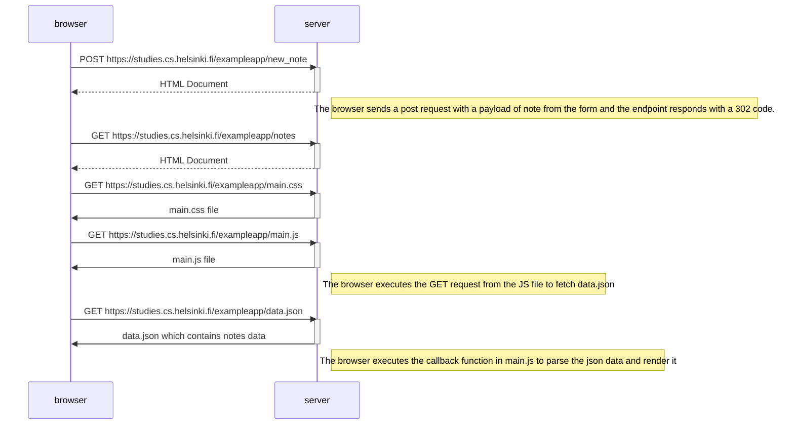

```mermaid
sequenceDiagram
    participant browser
    participant server

    browser->>server: POST https://studies.cs.helsinki.fi/exampleapp/new_note
    activate server
    server-->>browser: HTML Document
    deactivate server

    Note right of server: The browser sends a post request with a payload of note from the form and the endpoint responds with a 302 code.

    browser->>server: GET https://studies.cs.helsinki.fi/exampleapp/notes
    activate server
    server-->>browser: HTML Document
    deactivate server

    browser->>server: GET https://studies.cs.helsinki.fi/exampleapp/main.css
    activate server
    server->>browser: main.css file
    deactivate server

    browser->>server: GET https://studies.cs.helsinki.fi/exampleapp/main.js
    activate server
    server->>browser: main.js file
    deactivate server

    Note right of server: The browser executes the GET request from the JS file to fetch data.json

    browser->>server: GET https://studies.cs.helsinki.fi/exampleapp/data.json
    activate server
    server->>browser: data.json which contains notes data
    deactivate server

    Note right of server: The browser executes the callback function in main.js to parse the json data and render it
```